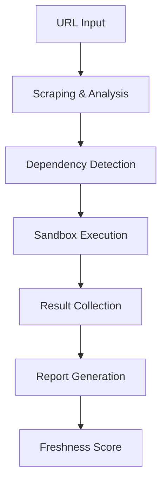

# <div align="center"><h1>VeriCode</h1></div>

<div align="center">

**Stop Documentation Rot. Start Verifying.**

[](https://vericode.example.com)
[](LICENSE)
[](https://github.com/yourusername/vericode/releases)
[](https://github.com/yourusername/vericode/actions)
[](https://github.com/yourusername/vericode/pulls)

VeriCode is a powerful tool that stress-tests technical documentation by executing code snippets against the latest dependencies in a sandboxed environment. Say goodbye to outdated tutorials and hello to reliable, verified code.

</div>

## 📋 Table of Contents

- [🌟 Key Features](#-key-features)
- [🤔 The Problem: Documentation Rot](#-the-problem-documentation-rot)
- [💡 The Solution: VeriCode](#-the-solution-vericode)
- [🛠️ How It Works](#-how-it-works)
- [🚀 Quick Start](#-quick-start)
- [📸 Screenshots](#-screenshots)
- [💻 Technology Stack](#-technology-stack)
- [🔧 Advanced Configuration](#-advanced-configuration)
- [📝 API Documentation](#-api-documentation)
- [🤝 Contributing](#-contributing)
- [🗺️ Roadmap](#️-roadmap)
- [❓ FAQ](#-faq)
- [📄 License](#-license)
- [🙏 Acknowledgments](#-acknowledgments)

## 🌟 Key Features

- **Live Code Validation**: Executes code snippets in a secure, isolated environment to check for correctness.
- **Dependency Freshness Check**: Automatically detects dependencies and runs code against their latest stable versions.
- **Detailed Error Reporting**: Pinpoints exactly why a snippet is outdated, providing clear error messages and context.
- **Freshness Score**: Get an at-a-glance percentage score indicating how up-to-date and reliable a tutorial is.
- **Community-Driven Caching**: Popular articles are cached for instant results, with the option to trigger a fresh scan.
- **Sharable Reports**: Every scan generates a unique, sharable URL for its report, making it easy to collaborate and share findings.
- **Multi-Language Support**: Works with JavaScript, TypeScript, Python, Ruby, Go, and more.
- **Customizable Execution Environment**: Configure specific versions or ranges of dependencies for testing.
- **Integration Options**: Available as a web app, CLI tool, and API service.

## 🤔 The Problem: Documentation Rot

"Documentation rot" is a pervasive issue in the software development ecosystem. Technical tutorials, blog posts, and official documentation become outdated as libraries, frameworks, and languages evolve. A tutorial that worked perfectly a year ago might be riddled with errors today due to breaking changes in its dependencies.

This leads to:
- Wasted development time
- Frustration and decreased productivity
- Loss of trust in documentation sources
- Potential propagation of outdated or insecure practices

## 💡 The Solution: VeriCode

VeriCode tackles this problem head-on by providing an automated way to verify that code examples in documentation still work with current versions of dependencies.

By simply providing a URL, VeriCode:
- Intelligently scrapes the page for code snippets
- Identifies the required technologies and their versions
- Executes each snippet in a sandboxed environment with the latest versions of those technologies
- Generates a clear, actionable "Freshness Report" that shows what still works and what's broken

## 🛠️ How It Works

1. **URL Input**: You provide a URL to a technical article or tutorial.
2. **Scraping & Analysis**: VeriCode scrapes the page, extracts all code snippets, and intelligently detects the dependencies mentioned (e.g., express, react, prisma).
3. **Sandbox Execution**: Each code snippet is executed in a secure, isolated sandbox environment with the latest stable versions of its detected dependencies.
4. **Report Generation**: A detailed report is generated with an overall "Freshness Score," and a breakdown of which snippets passed, failed, or resulted in an error.



## 🚀 Quick Start

Getting VeriCode up and running on your local machine is simple, even for non-coders.

### Prerequisites

- Node.js 18.0 or higher
- npm or yarn package manager
- (Optional) Docker for containerized deployment

### Installation

#### For Windows Users:

```bash
# Clone the repository
git clone https://github.com/yourusername/vericode.git
cd vericode

# Run the setup script
double-click run-vericode.bat
```

#### For Mac/Linux Users:

```bash
# Clone the repository
git clone https://github.com/yourusername/vericode.git
cd vericode

# Make the script executable and run it
chmod +x run-vericode.sh
./run-vericode.sh
```

The script will handle installing dependencies, setting up the database, and starting the web server. Once it's ready, open your browser and navigate to http://localhost:3000.

### Manual Installation

If you prefer to set up manually:

```bash
# Clone the repository
git clone https://github.com/yourusername/vericode.git
cd vericode

# Install dependencies
npm install

# Set up environment variables
cp .env.example .env.local
# Edit .env.local with your configuration

# Set up the database
npx prisma generate
npx prisma db push

# Start the development server
npm run dev
```

## 💻 Technology Stack

VeriCode is built with a modern, robust, and scalable tech stack:

### Frontend
- **Framework**: Next.js 15 (App Router)
- **Language**: TypeScript
- **UI**: React 19, Tailwind CSS, shadcn/ui, Recharts
- **State Management**: Zustand
- **Forms**: React Hook Form with Zod for validation

### Backend
- **Runtime**: Node.js
- **Real-time Updates**: Socket.IO
- **Database**: Prisma ORM with SQLite
- **Authentication**: NextAuth.js
- **API**: RESTful endpoints with OpenAPI specification

### DevOps & Testing
- **Testing**: Jest, Testing Library, Playwright
- **CI/CD**: GitHub Actions
- **Containerization**: Docker
- **Code Quality**: ESLint, Prettier, Husky

## 🔧 Advanced Configuration

### Environment Variables

VeriCode can be configured through environment variables:

```env
# Application
PORT=3000
NODE_ENV=development

# Database
DATABASE_URL="file:./dev.db"

# Authentication
NEXTAUTH_SECRET=your-secret-key
NEXTAUTH_URL=http://localhost:3000

# External Services
GITHUB_CLIENT_ID=your-github-client-id
GITHUB_CLIENT_SECRET=your-github-client-secret

# Sandbox Configuration
SANDBOX_TIMEOUT=30000
MAX_CONCURRENT_SANDBOXES=5
```

### Custom Sandbox Templates

You can create custom sandbox templates for specific technologies:

```javascript
// templates/javascript.js
module.exports = {
  setup: `
    const { dependencies } = require('./package.json');
    console.log('Installing dependencies:', Object.keys(dependencies).join(', '));
  `,
  timeout: 30000,
  allowedModules: ['express', 'react', 'lodash'],
  restrictedModules: ['fs', 'child_process']
};
```

## 📝 API Documentation

VeriCode provides a RESTful API for integrating with other tools and services.

### Authentication

All API requests require authentication using an API key:

```http
Authorization: Bearer your-api-key
```

### Endpoints

#### Analyze a URL

```http
POST /api/analyze
Content-Type: application/json
Authorization: Bearer your-api-key

{
  "url": "https://example.com/tutorial",
  "options": {
    "forceRefresh": false,
    "includeDependencies": ["react", "express"]
  }
}
```

#### Get Analysis Results

```http
GET /api/analysis/{analysisId}
Authorization: Bearer your-api-key
```

For full API documentation, visit `/api/docs` when running the application.

## 🤝 Contributing

Contributions are welcome! Whether you're fixing a bug, adding a new feature, or improving the documentation, your help is appreciated.

### Development Workflow

1. Fork the repository.
2. Create your feature branch (`git checkout -b feature/AmazingFeature`).
3. Commit your changes (`git commit -m 'Add some AmazingFeature'`).
4. Push to the branch (`git push origin feature/AmazingFeature`).
5. Open a Pull Request.

### Code Style

- Follow the existing code style
- Use TypeScript for all new code
- Write tests for new functionality
- Update documentation as needed

### Running Tests

```bash
# Run all tests
npm test

# Run tests in watch mode
npm run test:watch

# Run end-to-end tests
npm run test:e2e
```

## 🗺️ Roadmap

- [ ] **Multi-language Support**: Expand beyond JavaScript/TypeScript to support Python, Ruby, Go, and more
- [ ] **VS Code Extension**: Direct integration with VS Code for real-time documentation validation
- [ ] **GitHub Integration**: Automatic scanning of documentation in repositories
- [ ] **Historical Tracking**: Track how documentation freshness changes over time
- [ ] **AI-Powered Fixes**: Suggest automated fixes for outdated code snippets
- [ ] **Browser Extension**: Check documentation freshness while browsing
- [ ] **Team Features**: Organization accounts, team sharing, and collaboration tools

## ❓ FAQ

### How secure is the sandbox environment?

VeriCode uses multiple layers of isolation to ensure secure code execution:
- Containerized execution environments
- Restricted file system access
- Network isolation
- Resource limits (CPU, memory, execution time)
- Module whitelisting/blacklisting

### Can I test private documentation?

Yes, VeriCode supports authentication for private documentation through:
- Basic auth
- API keys
- Cookie-based authentication
- Custom headers

### How often are dependencies updated?

VeriCode checks for new dependency versions daily and automatically updates its testing environments. You can also force a refresh using the API or web interface.

### What types of documentation can VeriCode analyze?

VeriCode can analyze most web-based documentation including:
- Blog posts and tutorials
- Official documentation sites
- README files on GitHub
- Wiki pages
- Medium articles
- Technical documentation sites

## 📄 License

This project is licensed under the MIT License - see the [LICENSE](LICENSE) file for details.

## 🙏 Acknowledgments

- The Next.js team for the excellent framework
- The Prisma team for the modern ORM
- The shadcn/ui contributors for the beautiful UI components
- All the contributors who have helped improve VeriCode

---

<div align="center">

**Made with Z.ai by the me**

[](https://x.com/@thinkgenious)
[](https://discord.gg/WNC22caS)

</div>
